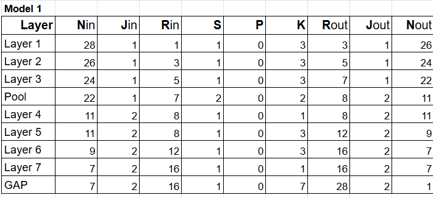
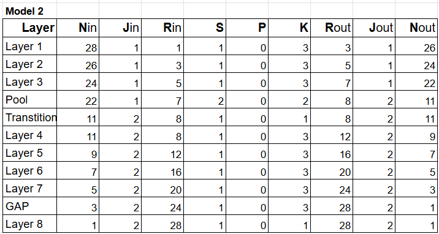
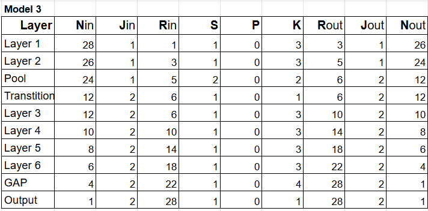

# Training CNN with less than 8000 parameters for CIFAR10 dataset

## Iteration 1

Model 1 - [File](./models/model_1.py)

### Target
*   Get the set-up right
*   Set Transforms
*   Set Data Loader
*   Set Basic Working Code
*   Set Basic Training  & Test Loop
*   Achieving > 99.4 % accuracy in less than 15 epochs

  
### Result

Model Parameters: 28,624  
Best Train Accuracy: 98.00  
Best Test Accuracy: 98.47
  
### Analysis
- Though the network has more than 26000 parameters, it could not achieve more than 99% accuracy in 15 epochs. So model is not converging quickly.
- Model is slightly under-fitting (or can be considered neither under-fitting nor over-fitting)
- Only Random rotation is added as Augmentation.
- In the architecture GAP size is 7 x 7. That might the reason of low accuracy as well.

### Receptive Field

  

## Iteration 2

Model 2 - [File](./models/model_2.py)

### Target
- Change Architecture to have less than 8000 parameters
- Reduce the GAP Kernel size to 3 x 3.
- Add layer after GAP and add layers to back to increase accuracy.
- Add batch normalization and dropout to regualarize the network as we have increased the number of layers in the architecture.
- Achieving > 99.4 % accuracy in less than 15 epochs

  
### Result

Model Parameters: 7344  
Best Train Accuracy: 99.17  
Best Test Accuracy: 99.22
  
### Analysis
- The network has been added with many layers, and Batch Norm, but it could not achieve more than 99.22% accuracy in 15 epochs. So model is not converging quickly.
- Dropout value might be high for this network.

### Receptive Field

  
## Iteration 3

Model 3 - [File](./models/model_3.py)

### Target
- Add more data augmentation (Cutout)
- Modify Architecture and increase some capacity within 8000 parameters.
- Adding dropout to all the layers
- Implement StepLR for updating learning rate for faster convergence.
- Switch to Adam optimiser to make the network adapt for individual weights.  

  
### Result

Model Parameters:  7,872  
Best Train Accuracy: 99.23  
Best Test Accuracy: 99.50 (8th epoch)
  
### Analysis
- Achieved 99.5% accuracy in 8th epoch and consistently more than 99.4% in 15 epochs.
- Achieved faster convergence with Data Augmentation and StepLR (Accuracy in 2nd epoch itself is more than 99%)
- Model is neither under-fitting or over-fitting. Started with under-fitting because of Augmentation, and picked up to more than 99% training accuracy.

### Receptive Field
